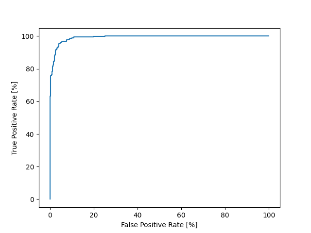

# ML Assignment 2

For this assignment, I used the keras and Tensorflow python libraries because I had used them a small bit before and knew I could access tutorials on different training methods.

 

To begin with, I trained the model with a single hidden layer with a Rectified Linear Activation Unit, and an output layer using a sigmoid function. This delivered results with percentages in the 55-58% range, barely better than chance. 

 

After achieving these results with the training model, I tried out scaling the data before changing the layers too much. After trying a couple of standardising methods, I settled on the StandardScaler as it delivered the best results. At the end of all the other changes, I tested out some different scalers again and still stayed with standard scaler. 

 

I spent most of my time testing out different layer combinations and activation functions.

The layers used in training were:

- 64 nodes - relu
- 32 nodes - relu
- 16 nodes - relu
- 16 nodes - relu
- 1 node - sigmoid function

Batch Normalisation caused training accuracy to level off at 60%-ish. Removed it, accuracy boosted to ~81%. 

 

I added another layer to have this:
- 128 nodes - relu
- 64 nodes - relu
- 32 nodes - relu
- 16 nodes - relu
- 16 nodes - relu
- 1 node - sigmoid function

Ran at 175 Epochs, 92% accuracy. Increased to 300 epochs because there was still an increase with each one to see if there was much change. This brought accuracy up to 94.79.%

 

K-Fold Cross Validation (k=8) results in the following:

***Avg Loss: 0.1708377432078123  
Avg Accuracy: 0.936879999935627***

### The ROC curve for the function:

